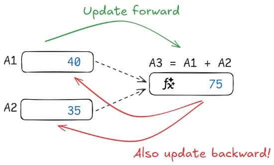

# ⇆ BIDICALC ⇆

BIDICALC is a bidirectional calculator, a spreadsheet where formulas also update
backwards.

  

In any normal spreadsheet, when you change values that are the input to some
formulas, the outputs are automatically updated. What if it worked the other
way? What if you could... change the output and see the input automatically
update to match the formulas? This is what bidicalc does!

**Bidicalc** is written in TypeScript and entirely open-source under the AGPL
licence. This means that you can freely reuse, modify, and share bidicalc as
long as you make the complete source code of your modified version available
under the same licence. If you are interested in buying bidicalc under a
different licence please get in touch.

## About me

My name is [Victor Poughon](https://victorpoughon.fr), I enjoy math and
open-source software. If you want to see me do more stuff like this consider
[sponsoring me on GitHub](https://github.com/sponsors/victorpoughon) or [Buying
me a coffee](https://www.buymeacoffee.com/victorpoughon).

Thank you 🤓❤️