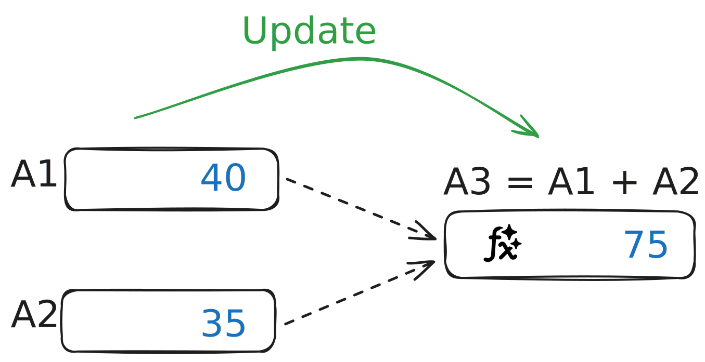
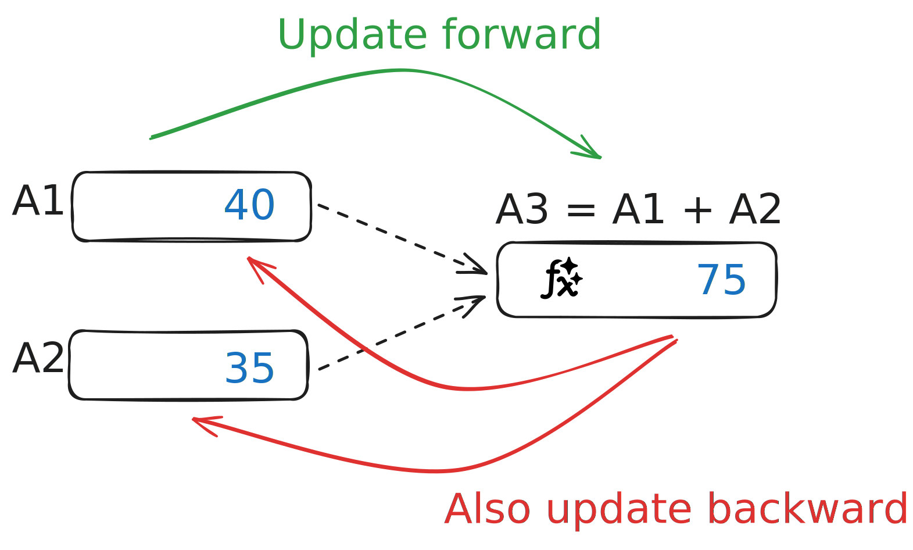

---
# https://vitepress.dev/reference/default-theme-home-page
layout: doc
sidebar: false
navbar: false
footer: false
prev: false
next: false
aside: false
---

<script setup>
// https://vitepress.dev/guide/ssr-compat
import { defineClientComponent } from 'vitepress'

const BidicalcGrid = defineClientComponent(() => {
  return import('../components/BidicalcGrid.vue');
});

</script>

<h1 class="main-title excalifont">bidicalc</h1>

<div class="bidicalc-tagline excalifont">
A spreadsheet where formulas also update backwards
</div>

<hr>
<div style="text-align: right">
— by <a href="https://victorpoughon.fr">Victor Poughon</a>
<br>
<a href="https://github.com/victorpoughon/bidicalc">GitHub</a>
|
<a href="https://www.buymeacoffee.com/victorpoughon" alt="Buy Me A Coffee" target="_blank">Buy me a Coffee</a> ☕
</div>

<hr>

In any normal spreadsheet, when you change values that are the input to some
formulas, the outputs are automatically updated:

{style="width: 60%; margin-bottom: 2rem"}

Could it also work the other way? What if you could also change the output, and have the inputs be updated to match the formula?

{style="width: 60%; "}

For the past few months I've been ~~obsessed~~ really curious about this idea. But there were so many questions:

-   Would it even be possible at all?
-   Could it work with very complex formulas? With exponents? With advanced math functions like `log()`, `abs()`, etc?
-   How would the UX work? In a normal spreadsheet, when you click on a cell that has a formula, you get to change the formula's expression. I would need a way to let the user change either the formula's expression or the cell's numeric value.
-   What should happen if there are multiple possible solutions? Like in the example above, if you set `A3` to 100, should the result be 50/50, 20/80, -10000/10100? When there is a infinite number of possible solutions, how to pick one?
-   Could it work with chained formulas? Could I build a long chain of formulas, update the final value and find the matching inputs all the way backwards?

Ok, now let's just skip to the good part! Today I'm happy to introduce:

<div class="bidicalc-main">
<hr/>
<div class="bidicalc-tagline" style="text-align: center">
bidicalc — a bidirectional calculator
</div>
<hr/>

<ClientOnly>
<BidicalcGrid />
</ClientOnly>

</div>

## User guide

### Type of cells

**Variables**<br>
A simple number entered in a cell is a variable: `1.0`. It may be changed by the solver.

**Constant**<br>
A number prefixed by a hash `#` is a constant. It will not be changed by the solver.

**Text**<br>
Cells can be in text mode. To input text, wrap in double quotes: `"Distance (km)"`.

**Formula**<br>
Formulas can be entered in a cell (the traditional `=` prefix is optional), for example:

```
A1 + A2
A1 + A2*(A3 - A1)^2
exp(A1)
#A1 + H5 * #H6
cos(2*pi())
```

The result of formulas will be automatically updated when an input they depend on changes. This is the usual **forward update**.

The magic of bidicalc is that once a formula has been computed, **you can change the result**. Bidicalc will walk "upstream" to change variable cells so that the formula's result matches the change you made. This is the **backward update**.

::: tip
To change a cell formula's expression instead of its result, click on the F icon.
:::

### Supported functions

-   Arithmetic operators: addition `+`, subtraction `-`, multiplication `*`, division `/`, exponentiation `^`.
-   `sqrt(x)`: square root of $x$
-   `pow(a, b)`: exponentiation, $a$ raised to the power of $b$
-   `pi()`: the $\pi$ constant
-   `abs(x)`: absolute value of $x$
-   `log(x)` / `ln(x)`: natural logarithm of $x$
-   `exp(x)`: exponential, the value of $e^x$
-   `cos(x)`/`sin(x)`/`tan(x)`: cosine / sine / tangent

### Keyboard shortcuts

`Ctrl + <arrows>` - Navigate the grid<br>
`Enter` - Move down<br>
`Shift-Enter` - Move up<br>
`Tab` - Move right<br>
`Shift-Tab` - Move left<br>

## The backwards solver

The solver will try its best to find a solution. However it can fail in different ways:

-   **The solution is incorrect.**<br>This is a bug and should not happen: please [report it on GitHub](https://github.com/victorpoughon/bidicalc/issues), thank you!

-   **The solver reports "no solution", but there is one.** This could be a bug in the solver, or you have found a particularly difficult root finding problem that has solutions that are very difficult to find using floating point arithmetic. Please [report it on GitHub](https://github.com/victorpoughon/bidicalc/issues) so I can use it to improve the solver :)

-   **The solution is technically correct but unexpected.**<br>This can happen for
    a large class of problems, typically when there are a lot of free variables
    (the problem is heavily underdetermined) and the solution manifold is weird.
    For example, try to solve `a*b*c = 1` to see this in action. To combat
    this, you can:

    -   Set some variables to constants using the hash syntax, i.e.: `#50`.
    -   Reformulate the problem with fewer free variables.
    -   Wait for me to implement more features like domain restrictions of variables.
    -   Suggest improvements to the open-source solver [on GitHub](https://github.com/victorpoughon/bidicalc/issues).

::: danger
Keep in mind this is an experiment I made for fun because I like math and
spreadsheets. If you need to do root finding to compute the load tolerance of a
one milion ton suspended bridge please don't use bidicalc :D
:::

### How does it work?

Even a normal spreadsheet is fairly complex beast. But the novel thing about
bidicalc is the backwards solver. Mathematically, updating a spreadsheet
"backward" is a (potentially underdetermined) root finding problem, because we
are trying to find a vector of unknowns $x$ such that $F(x) - G = 0$, where F is
the function computed by the cells formulas, and G is the objective value
entered in the cell. Note that F is not necessarily a single formula, but the
result of composing an upstream graph of cells into a single function.

The actual root-finding solver is a custom algorithm that I made. It a general
purpose algorithm that will find one root of any continuous-almost-everywhere
function for which a complete syntactic expression is known. It uses a mix of
continuous constraint propagation on [interval union
arithmetic](https://github.com/victorpoughon/not-so-float) , [directional
Newton's method](https://www.jstor.org/stable/2698870) and dichotomic search. It
is of course limited by floating point precision and available computation time.

**Bidicalc** is written in TypeScript and [entirely
open-source](https://github.com/victorpoughon/bidicalc) under the AGPL licence.
This means that you can freely reuse, modify, and share bidicalc as long as you
make the complete source code of your modified version available under the same
licence. If you are interested in buying bidicalc under a different licence
please get in touch.

I haven't taken the time to write a full deep-dive mathematical explanation of
how it works, but if you are interested in that please [let me
know](https://victorpoughon.fr). I might find some time to do it if there is
interest from fellow math nerds.

## Future improvements

If I kept improving bidicalc until it was perfect I would have never released
it. So currently **it is imperfect** and could be improved in a number of ways.

-   Domain restriction for variables. Currently the solver may assign any value in
    the interval $[-10^{10}, 10^{10}]$. I'd like to add special syntax so that
    variable cells can be restricted by the user to a specific interval. This
    would allow guiding the solver and saying that you only want this cell to be
    positive, of to be between 1 and 100, for example.
-   Solver improvements. The algorithm works well enough for simple problems so
    I'm happy to publish in this current state, but could always be improved.
    There are a milion ways to improve it in the future so that it finds better
    solutions, particularly for highly underdetermined cases.
-   float64 gradients support. Due to a pretty obscure technical limitation of
    [tensorflowjs](https://github.com/tensorflow/tfjs) (that I use to compute
    gradients), the backward solver is partially limited to single precision, even
    though the forward solver uses double precision via native JS numbers.
-   UX improvements. I am not very good at front-end dev :D. I have learned vuejs
    to be able to make the UX for bidicalc but I'm not great at it. A spreadsheet
    interface is actually a massive state machine of complex and subtle behavior,
    it's a very interesting project and tricky to get right. As you can see, I've
    decided to skip the usual spreadsheet design principle that cells have two
    selection states: soft selected which enables dragging, selection, etc. and
    hard selected which enables changing the content of the cell. bidicalc is
    simply a CSS grid of `<input>` elements.
-   Move cell computation off the main thread. The solver is single threaded and
    happens in the UI thread. It should be moved to a web worker to avoid locking
    the UI.

## About me

My name is [Victor Poughon](https://victorpoughon.fr), I enjoy math and
open-source software. If you want to see me do more stuff like this consider
[sponsoring me on GitHub](https://github.com/sponsors/victorpoughon) or [Buying
me a coffee](https://www.buymeacoffee.com/victorpoughon).

Thank you <3

<style>

h1.main-title {
  font-size: 5rem;
  margin-top: 0.8rem;
  margin-bottom: 1.6rem;
}

.bidicalc-tagline {
  font-size: 1.4rem;
  font-weight: bold;
  font-style: italic;
}

img {
  display: block;
  margin-left: auto;
  margin-right: auto;
}

.bidicalc-main {
  margin-bottom: 3rem;
  margin-top: 3rem;
}
</style>
